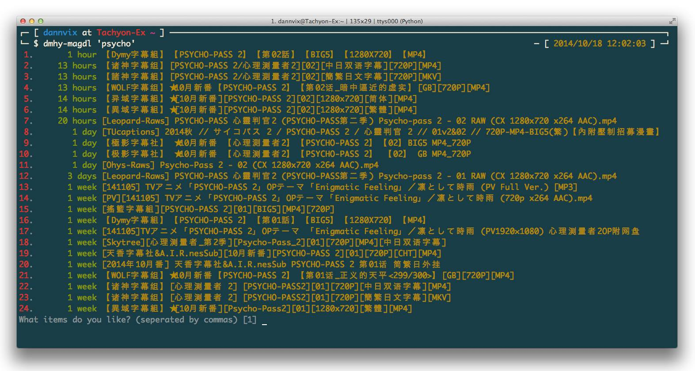

# dmhy-magdl

## Original

It was a command-downloader for share.dmhy.org from my friend @dannvix

## Modify

- move to python 3
- add [popcorntime.io](https://popcorntime.io/) as the torrent player

## Screenshot

- original

- my fork

